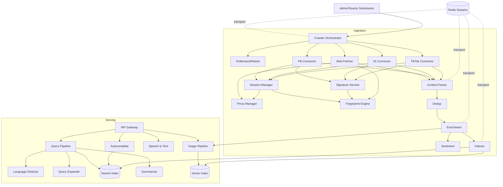

---
tags:
  - architecture
type: index
status: specified
updated: 2026-08-06
---

# Component Map

> The authoritative inventory of every component, its plane, its owner binary, and its neighbours.
> Parent: [[System Architecture]]

---

## 1. Inventory

### Serving plane

| # | Component | Binary | Depends on | Consumed by |
|:--|:---|:---|:---|:---|
| C01 | [[API Gateway]] | `xustive-api` | [[Query Pipeline]] | browser |
| C02 | [[Query Pipeline]] | `xustive-api` | C03, C04, C06, C07, C08 | C01 |
| C03 | [[Language Detector]] | `xustive-api` | — | C02, C15 |
| C04 | [[Query Expander]] | `xustive-api` | lexicon, DziriBERT | C02, C09 |
| C05 | [[Autocomplete Service]] | `xustive-api` | C06 | C01 |
| C06 | [[Search Index]] | `meilisearch` | — | C02, C05, C19 |
| C07 | [[Vector Index]] | `qdrant` | — | C02, C11, C19 |
| C08 | [[Summarizer]] | `xustive-ml` | model files | C02 |
| C09 | [[Speech to Text]] | `xustive-ml` | model files | C01 |
| C10 | [[Image Pipeline]] | `xustive-ml` | C07, tesseract, CLIP | C01, C17 |

### Ingestion plane

| # | Component | Binary | Depends on | Consumed by |
|:--|:---|:---|:---|:---|
| C11 | [[Crawler Orchestrator]] | `xustive-crawler` | C20, C21, C22 | — |
| C12 | [[Web Fetcher]] | `xustive-crawler` | C20, C21 | C11 |
| C13 | [[Social Connector - Facebook]] | `xustive-crawler` | C20, C21, C25, C26, C27 | C11 |
| C14 | [[Social Connector - Instagram]] | `xustive-crawler` | C20, C21, C25, C26, C27 | C11 |
| C15 | [[Social Connector - TikTok]] | `xustive-crawler` | C20, C21, C25, C26, C27 | C11 |
| C16 | [[Content Parser]] | `xustive-worker` | C03 | queue |
| C17 | [[Enrichment Pipeline]] | `xustive-worker` | C10, C18 | queue |
| C18 | [[Sentiment Engine]] | `xustive-worker` / `xustive-ml` | lexicon, model | C17 |
| C19 | [[Indexer Worker]] | `xustive-worker` | C06, C07 | queue |
| C23 | [[Deduplication Service]] | `xustive-worker` | Redis | C16, C17 |

### Platform

| # | Component | Binary | Depends on | Consumed by |
|:--|:---|:---|:---|:---|
| C20 | [[Task Queue]] | `redis` | — | all ingestion |
| C21 | [[Proxy Manager]] | `xustive-crawler` | proxy pool | C12–C15 |
| C22 | [[Politeness and Robots]] | `xustive-crawler` | C20 | C11, C12 |
| C24 | [[Admin and Source Submission]] | `xustive-api` | C20, C06 | operators |

### Collection layer

Added by [[ADR-0009 - Direct Collection for Social Platforms]]. These three carry all the
direct-collection complexity so the connectors stay readable.

| # | Component | Binary | Depends on | Consumed by |
|:--|:---|:---|:---|:---|
| C25 | [[Session Manager]] | `xustive-crawler` | C20, C21, C26 | C13–C15 |
| C26 | [[Fingerprint Engine]] | `xustive-crawler` | catalogue files | C12, C25, C27 |
| C27 | [[Signature Service]] | `xustive-crawler` | C20, C26, JS runtime | C13–C15 |

---

## 2. Dependency Graph



---

## 3. Component Note Template

Every note in `Components/` uses these sections, in this order. Keep them even when short — an empty
section with "n/a" is information; a missing section is ambiguity.

```markdown
---
tags: [component, <plane>]
component-id: Cxx
binary: xustive-*
status: draft|specified|implemented|verified
updated: YYYY-MM-DD
---
# <Name>
> **ID** Cxx · **Binary** … · **Upstream** [[…]] · **Downstream** [[…]]

## 1. Purpose            — one paragraph, why this exists
## 2. Responsibilities   — in scope / explicitly out of scope
## 3. Interface          — public API, message shapes, traits
## 4. Internal Design    — algorithm, state, concurrency model
## 5. Configuration      — every knob, type, default, unit
## 6. Data               — what it reads/writes, schemas
## 7. Failure Modes      — table: failure → detection → response
## 8. Performance        — budget, throughput, memory
## 9. Observability      — metrics, log events, spans
## 10. Security          — trust boundary, input validation
## 11. Testing           — unit, integration, fixtures, acceptance
## 12. Open Questions
## Related
```

---

## 4. Status Board

| Status | Meaning |
|:---|:---|
| `draft` | Note exists, design not settled |
| `specified` | Design agreed; ready to implement |
| `implemented` | Code merged, unit-tested |
| `verified` | Meets its [[Performance Budgets]] entry under integration test |

Query the board in Obsidian with the tag pane (`#component`) or a Bases/Dataview view over
`status` frontmatter.

## Related

[[System Architecture]] · [[Data Model]] · [[TODO]] · [[Decision Log]]
