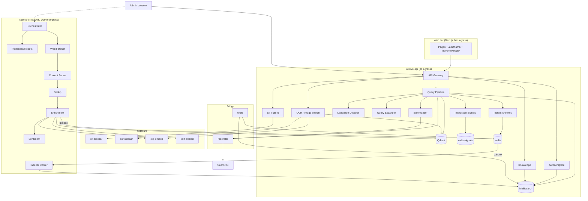

---
tags:
  - architecture
type: index
status: implemented
updated: 2026-08-27
---

# Component Map

> The authoritative inventory of every component, its plane, its owner process, and its neighbours.
> Parent: [[System Architecture]]

> **Audited against the code on 2026-08-27.** The "Binary" column names what actually runs. The
> 2026-08-06 plan had `xustive-ml`, `xustive-crawler` and `xustive-worker` binaries; none exists.
> ML lives inside `xustive-api` (llama.cpp) or in Python sidecars under `services/`; the crawl side
> is `xustive-cli crawld` and `xustive-cli worker`. The component notes' own `binary:` frontmatter
> still carries the old names — this table is the corrected one.

---

## 1. Inventory

### Serving plane

| # | Component | Binary / crate | Depends on | Consumed by |
|:--|:---|:---|:---|:---|
| C01 | [[API Gateway]] | `xustive-api` | C02, C05, C28, C09, C10, C30 | web tier |
| C02 | [[Query Pipeline]] | `xustive-api` (`search.rs`), `xustive-text` | C03, C04, C06, C07, C08, C30, C31 | C01 |
| C03 | [[Language Detector]] | `xustive-lang` | lexicon | C02, C05 |
| C04 | [[Query Expander]] | `xustive-lang` | lexicon, morphology, transliteration tables (no DziriBERT — never built) | C02 |
| C05 | [[Autocomplete Service]] | `xustive-api` (`suggest.rs`) | C06, curated list | C01 |
| C06 | [[Search Index]] | `meilisearch` — indexes `documents`, `comments`, `knowledge`; client crate `xustive-search` | — | C02, C05, C19, C28, C29 |
| C07 | [[Vector Index]] | `qdrant` — collections `image_clip`, `text_bge`; client crate `xustive-vector` | `clip-embed`, `text-embed` sidecars | C02, C10, C17 |
| C08 | [[Summarizer]] | `xustive-api` via `xustive-ml` (llama.cpp, feature `summariser`; `cuda` optional); opt-in external LLM via C31 | GGUF model on disk | C02 |
| C09 | [[Speech to Text]] | `services/stt-sidecar` (faster-whisper `small` + `base` for partials, GPU when present), client `xustive-api/stt.rs` | model volume | C01 |
| C10 | [[Image Pipeline]] | tesseract in-process (`xustive-media`) or `services/ocr-sidecar`; `services/clip-embed`; `xustive-api/image_search.rs` | C07 | C01, C17 |
| C28 | [[Instant Answers]] | `xustive-tools` (calculator via fend, units, dates, prayer, fuel, exam, wilaya, utilities, translator, transliterator); weather + currency handlers in `xustive-api` | C29 cache, geoip (DB-IP, local) | C02 |
| C29 | [[Tool Data Plane]] | `xustive-toold` — weather (Open-Meteo), rates (open.er-api), Wikidata knowledge harvest | Redis, C06 (`knowledge`) | C28, C32 |
| C30 | [[Interaction Signals]] | `xustive-api/interaction.rs`, `xustive-ingest/interaction.rs` | `redis-signals` | C02, admin |
| C32 | Knowledge layer ([[ADR-0019 - The Knowledge Layer]]; documented under [[Instant Answers]]) | `xustive-knowledge` (entity model, kind table, resolver, templates, Wikidata parsing); `xustive-api/knowledge.rs`; web `/api/knowledge-live`, `/api/knowledge-list` | C06 (`knowledge`), C29 | C01, web tier |

### Bridge processes (dual-homed, the only crossings of the egress boundary)

| # | Component | Binary | Depends on | Consumed by |
|:--|:---|:---|:---|:---|
| C29 | [[Tool Data Plane]] | `xustive-toold` (`ingest` + `core`) | open internet, Redis, Meilisearch | C28, C32 |
| C31 | [[Federation Gateway]] | `xustive-federator` (`core` + `ingest`); client crate `xustive-federation` | `searxng` (profile `federation`) | C02, C08 |

### Ingestion plane

| # | Component | Binary / crate | Depends on | Consumed by |
|:--|:---|:---|:---|:---|
| C11 | [[Crawler Orchestrator]] | `xustive-cli crawld` → `xustive-ingest::orchestrator` | C20 (frontier, revisit, raw store, link graph, crawl stats in Redis), C22 | — |
| C12 | [[Web Fetcher]] | `xustive-ingest::fetch` | C22, `SafeUrl` (`xustive-core`) | C11 |
| C13 | [[Social Connector - Facebook]] | **not built** | — | — |
| C14 | [[Social Connector - Instagram]] | **not built** | — | — |
| C15 | [[Social Connector - TikTok]] | **not built** | — | — |
| C16 | [[Content Parser]] | `xustive-ingest::parse`, `rules`, `date`; media via `xustive-media` | C03 | C11 (in-process) |
| C17 | [[Enrichment Pipeline]] | `xustive-ingest::enrichment`, `spam`, `topics`, `media_ocr`, `media_embed`, `text_embed` | C10, C18, C07 | C11 (in-process) |
| C18 | [[Sentiment Engine]] | `xustive-lang::sentiment` (lexicon; no transformer mode) | lexicon | C17 |
| C19 | [[Indexer Worker]] | `xustive-cli worker` → `xustive-queue::indexer` | C06, C20 | queue |
| C23 | [[Deduplication Service]] | `xustive-ingest::dedup`, `simhash_index` | Redis | C11 (in-process) |
| — | Discovery channels: Common Crawl (`commoncrawl`), Brave (`brave`), direct SERP (`serp`), weak-coverage (`weak_coverage`), sitemap polling | `xustive-cli commoncrawl|discover|crawld` | C20 | C11 — see [[ADR-0012 - Discovery-Only Aggregation]], [[ADR-0013 - Direct SERP Collection for Discovery]] |

### Platform

| # | Component | Binary | Depends on | Consumed by |
|:--|:---|:---|:---|:---|
| C20 | [[Task Queue]] | `redis` — stream `q:index`, group `indexers`, dead letters `q:index:dead`; crate `xustive-queue` | — | C11, C19, admin |
| C21 | [[Proxy Manager]] | `xustive-ingest::proxy` — **library only**, not called by the crawl loop | proxy pool | nothing yet |
| C22 | [[Politeness and Robots]] | `xustive-ingest::robots`, `robots_cache` | C20 | C11, C12 |
| C24 | [[Admin and Source Submission]] | `xustive-api/admin*.rs` under `/api/v1/admin/*`; pages under `web/app/(operator)/admin/*` and `/bot` | C20, C06, `api.admin_key` | operators |
| — | [[Crawler Console]] | the admin pages: crawler, discovery, documents, queue, sources, sources/health, weak-coverage, evaluation, interaction, media, integrations, live, maintenance, compute, config | C24 | operators |
| — | Load generator | `xustive-loadgen` (`make load`) | C01 | [[Performance Budgets]] |

### Collection layer

Added by [[ADR-0009 - Direct Collection for Social Platforms]]. These carry the direct-collection
complexity so the connectors stay readable. As of 2026-08-27 they are **library modules with
tests** in `xustive-ingest` and nothing in `crawld` or the SERP client constructs them; the
connectors they were built for (C13–C15) do not exist.

| # | Component | Module | Depends on | Consumed by |
|:--|:---|:---|:---|:---|
| C25 | [[Session Manager]] | `xustive-ingest::session` (budget, lifecycle, detection, crypto, pool) | C20, C21, C26 | nothing yet |
| C26 | [[Fingerprint Engine]] | `xustive-ingest::fingerprint` (catalogue, coherence) | catalogue files | nothing yet |
| C27 | [[Signature Service]] | **not built** | — | — |

---

## 2. Dependency Graph



---

## 3. Component Note Template

Every note in `Components/` uses these sections, in this order. Keep them even when short — an empty
section with "n/a" is information; a missing section is ambiguity.

```markdown
---
tags: [component, <plane>]
component-id: Cxx
binary: xustive-*
status: draft|specified|implemented|verified
updated: YYYY-MM-DD
---
# <Name>
> **ID** Cxx · **Binary** … · **Upstream** … · **Downstream** …

## 1. Purpose            — one paragraph, why this exists
## 2. Responsibilities   — in scope / explicitly out of scope
## 3. Interface          — public API, message shapes, traits
## 4. Internal Design    — algorithm, state, concurrency model
## 5. Configuration      — every knob, type, default, unit
## 6. Data               — what it reads/writes, schemas
## 7. Failure Modes      — table: failure → detection → response
## 8. Performance        — budget, throughput, memory
## 9. Observability      — metrics, log events, spans
## 10. Security          — trust boundary, input validation
## 11. Testing           — unit, integration, fixtures, acceptance
## 12. Open Questions
## Related
```

---

## 4. Status Board

| Status | Meaning |
|:---|:---|
| `draft` | Note exists, design not settled |
| `specified` | Design agreed; ready to implement |
| `implemented` | Code merged, unit-tested |
| `verified` | Meets its [[Performance Budgets]] entry under integration test |

Query the board in Obsidian with the tag pane (`#component`) or a Bases/Dataview view over
`status` frontmatter. Note (2026-08-27): most component notes still say `specified` in their
frontmatter although the code is built and tested — the frontmatter has not been kept current,
so trust the milestone notes ([[Milestone 7 - Federated Retrieval and External Tools]],
[[Milestone 8 - The Answer Layer]], [[Milestone 9 - Images and Videos]]) for what is closed.

## 5. Crate Index

The workspace, so a name in this vault can be found on disk.

| Crate | Role |
|:---|:---|
| `xustive-core` | canonical types, error taxonomy, config, `SafeUrl` SSRF guard, source registry |
| `xustive-text` | shared normalisation, used at query *and* index time |
| `xustive-lang` | detection, expansion, lexicon, morphology, transliteration, question shape, sentiment |
| `xustive-search` | Meilisearch client, index settings, filters, operators, ranking, authority, eval |
| `xustive-vector` | Qdrant REST client; CLIP and text embedding calls |
| `xustive-ml` | device selection, model registry, llama.cpp summariser, translation |
| `xustive-tools` | instant answers: matching, arbitration, the tools |
| `xustive-knowledge` | entity model, kind table, resolver, panel templates, Wikidata parsing |
| `xustive-media` | image OCR backends, perceptual hash |
| `xustive-ingest` | fetch, robots, parse, dedup, enrichment, frontier, discovery channels, SERP |
| `xustive-queue` | Redis Streams: produce, consumer group, ack, reclaim, dead-letter, breaker |
| `xustive-federation` | SearXNG client types (leaf crate) |
| `xustive-federator` | the Federation Gateway binary |
| `xustive-toold` | the tool data fetcher binary |
| `xustive-api` | the HTTP surface |
| `xustive-cli` | operator tooling: migrate, seed, crawld, worker, dlq, eval, registry, keys… |
| `xustive-loadgen` | open-loop load generator |

## Related

[[System Architecture]] · [[Data Model]] · [[TODO]] · [[Decision Log]]
