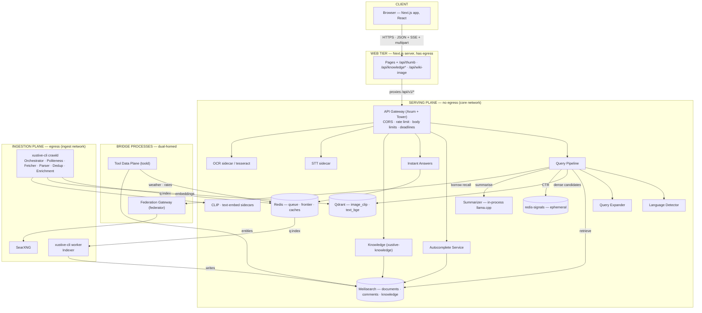

---
tags:
  - architecture
type: architecture
status: implemented
updated: 2026-08-27
---

# System Architecture

> Parent: [[Xustive Search Engine – Technical Specification]] · Inventory: [[Component Map]]

> **Audited against the code on 2026-08-27.** The 2026-08-06 version of this note described the
> planned shape; where the built system differs the difference is stated here with the date, and
> the original reasoning is kept.

---

## 1. Architectural Style

Xustive is a **two-plane system** ([[ADR-0001 - Two-Plane Architecture]]):

- **Serving plane** — synchronous, latency-bound, stateless Rust services in front of two indexes.
  It has **no route to the internet**: the `core` Docker network is `internal: true`, and
  `make egress-test` proves it from inside a container.
- **Ingestion plane** — asynchronous, throughput-bound, queue-driven processes on the one network
  with egress (`ingest`).

The only coupling between planes is the **index** ([[Search Index]], [[Vector Index]]) and the
one Redis Stream between them (`q:index`, [[Task Queue]]). Ingestion can be entirely down and
search still serves; search can be down and ingestion keeps filling the queue and the index. This
is deliberate: crawling is the fragile part, and it must never be able to take search offline.

Two things sit *across* the boundary on purpose, and each is a separate process with a fixed job
so the separation stays a build-time fact rather than a runtime hope:

- **[[Tool Data Plane]]** (`xustive-toold`, dual-homed `ingest`+`core`) fetches weather, exchange
  rates and the Wikidata knowledge harvest on a schedule into caches the serving plane reads. It
  takes no user input at all.
- **[[Federation Gateway]]** (`xustive-federator`, dual-homed `core`+`ingest`) is the one
  allowlisted egress hop for a *query*: the API hands it normalised query text, it asks a
  self-hosted SearXNG, and hands back hits ([[ADR-0017 - Query-Time Federation with External Metasearch]]).
  Off by default (`federation.enabled = false`, compose profile `federation`).

A third exception is the **web tier**: the Next.js server (`web/`) has egress and is where the
Wikipedia/Wikidata lookups for the knowledge panel run ([[ADR-0014 - Knowledge Panel from Wikipedia via the Web Tier]],
[[ADR-0019 - The Knowledge Layer]]) and where thumbnails are proxied ([[ADR-0021 - Proxied Thumbnails with Signed URLs]]).
The browser talks only to that one origin.

Everything runs inside one Docker Compose project on Algerian infrastructure. No component sends a
query or a reader's address to a third-party AI/analytics service — see [[Security and Privacy]].
The one opt-in exception, the external summariser, goes through the Federation Gateway and is
off by default (`ml.external_summaries = false`).

---

## 2. Layer Diagram

**Legend — every box links to its specification:**

| Layer | Components |
|:---|:---|
| Client + web tier | [[UI Specification]] · [[UI - Frontend Architecture]] (Next.js server routes: `/api/thumb`, `/api/knowledge`, `/api/knowledge-live`, `/api/knowledge-list`, `/api/wiki-image`) |
| Edge | [[API Gateway]] (`xustive-api`, Axum) |
| Serving | [[Query Pipeline]] · [[Language Detector]] · [[Query Expander]] · [[Autocomplete Service]] · [[Instant Answers]] · [[Speech to Text]] · [[Image Pipeline]] · [[Search Index]] · [[Vector Index]] · [[Summarizer]] · [[Interaction Signals]] |
| Bridge | [[Tool Data Plane]] · [[Federation Gateway]] |
| Ingestion | [[Crawler Orchestrator]] · [[Politeness and Robots]] · [[Web Fetcher]] · [[Content Parser]] · [[Deduplication Service]] · [[Enrichment Pipeline]] · [[Indexer Worker]] · [[Task Queue]] |
| Not built | [[Social Connector - Facebook]] · [[Social Connector - Instagram]] · [[Social Connector - TikTok]] — specified only. [[Session Manager]] · [[Fingerprint Engine]] · [[Proxy Manager]] · [[Signature Service]] exist as tested library modules in `xustive-ingest` (`session/`, `fingerprint/`, `proxy/`) but nothing in the crawl loop calls them yet (verified 2026-08-27). Added by [[ADR-0009 - Direct Collection for Social Platforms]]; sequencing in [[TODO]]. |
| Platform | [[Observability]] (Prometheus · Grafana · tracing) · [[Deployment Topology]] (Docker Compose) |

---

## 3. Serving Path (a single text query)

`GET /api/v1/search?q=…[&v=all|news|images|videos]` — the handler is `crates/xustive-api/src/search.rs`.

| # | Step | Component | Budget |
|:--|:--|:--|:--|
| 1 | Concurrency limit, per-IP rate-limit, deadline, `request_id` | [[API Gateway]] | 2 ms |
| 2 | Instant-answer match on the **raw** query (calculator, units, dates, prayer, fuel, exam, wilaya, utilities, translate, transliterate; weather and currency read the [[Tool Data Plane]] cache) | [[Instant Answers]] | 1 ms |
| 3 | Search operators (`"…"`, `-`, `site:`) come off the raw query; then normalise (NFKC, tatweel strip, diacritics fold) | [[Query Pipeline]], `xustive-text` | 1 ms |
| 4 | Detect language + script | [[Language Detector]] | 3 ms |
| 5 | If federation is on and this is page 1: start a **detached** federated fetch in the vertical's SearXNG category (web/images/videos) | [[Federation Gateway]] | off the critical path |
| 6 | Retrieve from Meilisearch (documents; comments when the vertical asks). Verticals are saved filters over the one index: `news` = dated web documents, `images`/`videos` = `media.type` facet | [[Search Index]] | 50 ms |
| 7 | If few or weak hits: expand Darija / Arabizi / French variants and retrieve again, merge | [[Query Expander]] | 8 ms |
| 8 | If `vector.text_enabled`: dense candidates from Qdrant (`text_bge`), fused into the set | [[Vector Index]] | optional |
| 9 | Anonymous CTR for the candidate ids from `redis-signals`, then re-rank (authority, freshness, language, interaction) and build facets | [[Ranking and Relevance]], [[Interaction Signals]] | 15 ms |
| 10 | Wait up to the strip budget for step 5; federated hits not back in time are still indexed in the background (`federation.eager_index`) and are local on the next search | [[Federation Gateway]] | ≤ `federation.budget_ms` |
| 11 | Serialise `results` (with `summary_token`, `interaction_token`, `instant`) → flush | [[API Gateway]] | 5 ms |
| 12 | Client `POST /api/v1/summary` with the token; tokens stream over SSE | [[Summarizer]] | `ml.deadline_ms` |
| 13 | Client asks the knowledge panel: `GET /api/v1/knowledge` reads the `knowledge` index; on a miss the web tier's `/api/knowledge-live` looks Wikidata up and hands the raw document to `POST /api/v1/knowledge/render` | [[Instant Answers]] §knowledge, [[ADR-0019 - The Knowledge Layer]] | separate request |

**Key decision:** steps 1–11 return before step 12 begins. The client renders links immediately and
the AI summary streams in above them. The summary is *never* on the critical path — if
[[Summarizer]] is saturated the response simply omits it. See
[[ADR-0004 - Stream Summary Separately from Results]]. Steps 12 and 13 are separate requests for
the same reason.

## 4. Ingestion Path (a single document)

The pipeline is **one process per side of the queue**, not one process per stage as first planned
(2026-08-06). `xustive-cli crawld` runs orchestration, fetch, parse, dedup and enrichment
in-process and produces to `q:index`; `xustive-cli worker` consumes it and writes to Meilisearch.
Splitting fetch from index across a stream is what keeps an index outage a growing backlog rather
than a stopped crawl; splitting the *other* stages across streams bought nothing at this scale.

| # | Stage | Component | Where |
|:--|:---|:---|:---|
| 1 | Seeds / registry / sitemaps / discovery channels → shared Redis frontier, per-host budget, revisit scheduling | [[Crawler Orchestrator]], [[Data Sources Registry]] | `crawld` |
| 2 | robots.txt, crawl-delay, per-host concurrency | [[Politeness and Robots]] | `crawld` |
| 3 | Retrieve bytes (static fetch; `SafeUrl` SSRF guard) | [[Web Fetcher]] | `crawld` |
| 4 | Raw HTML → canonical `Document` ([[Data Model]]); per-domain rules; media extraction (`xustive-media`, [[Image Pipeline]]) | [[Content Parser]] | `crawld` |
| 5 | Exact-hash + SimHash near-duplicate gate | [[Deduplication Service]] | `crawld` |
| 6 | Quality/spam, topics, date, link graph; optional image OCR, CLIP and text embeddings via sidecars | [[Enrichment Pipeline]], [[Sentiment Engine]] | `crawld` |
| 7 | `XADD q:index` (capped by `queue.index_stream_max_len`) | [[Task Queue]] | `crawld` → Redis |
| 8 | Consumer group `indexers`, batched upserts, **ack after Meilisearch reports the task durable**; 3 attempts then `q:index:dead` | [[Indexer Worker]] | `worker` → [[Search Index]] |

The [[Vector Index]] is written from the enrichment side (embeddings are computed where the bytes
are), not by the indexer. Failures land in the dead-letter stream, replayable with `make dlq` or
from the admin console. See [[Task Queue]] and [[Error Handling and Resilience]].

---

## 5. Boundaries and Contracts

| Boundary | Contract | Owner |
|:---|:---|:---|
| Browser ↔ web tier | Next.js pages; `/api/v1/*` is proxied through to the API so the CSP stays `default-src 'self'` | [[UI - Frontend Architecture]] |
| Web tier ↔ Gateway | [[API Contract]] (versioned `/api/v1`) | [[API Gateway]] |
| Gateway ↔ serving components | In-process Rust crates, `async fn` | [[Query Pipeline]] |
| Gateway ↔ sidecars | Small HTTP contracts: `POST /ocr`, `POST /embed`, `POST /transcribe`, `GET /health` | `services/*/README.md` |
| Gateway ↔ Federation Gateway | `POST /federate` on `federation.federator_url`; `/summarise` for the external LLM | [[Federation Gateway]] |
| crawld ↔ worker | JSON `IndexJob` on the `q:index` Redis Stream | [[Task Queue]] |
| Any writer ↔ index | `Document` / `Comment` / `Entity` structs | [[Data Model]] |
| Ops ↔ everything | `/healthz`, `/readyz`, `/metrics` | [[Observability]] |
| Operator ↔ API | `/api/v1/admin/*`, gated by `api.admin_key` in `X-Admin-Key` (loopback-only when unset) | [[Admin and Source Submission]] |

**Rule:** ingestion processes never read the serving API. Everything they share (frontier, robots
cache, crawl stats, link graph, raw store, the index stream) lives in Redis, so any process can be
restarted, replayed, or scaled without coordination.

---

## 6. Process and Deployment Units

What actually runs (see `make dev` / `scripts/dev.sh` and [[Running Xustive]] §3). The
2026-08-06 plan named four Rust binaries (`xustive-api`, `xustive-ml`, `xustive-crawler`,
`xustive-worker`); the built system folded ML into the API and the crawl side into `xustive-cli`
subcommands, and put every model that is not llama.cpp behind a Python sidecar.

| Process | Contains | Scale unit | Stateless? |
|:---|:---|:---|:---|
| `xustive-api` | [[API Gateway]], [[Query Pipeline]], [[Language Detector]], [[Query Expander]], [[Autocomplete Service]], [[Instant Answers]], knowledge resolver, [[Summarizer]] (llama.cpp in-process, feature `summariser`, `cuda` optional), [[Interaction Signals]], clients for every sidecar | replicas behind LB | yes |
| `web` (Next.js) | pages, `/api/thumb`, `/api/knowledge*`, `/api/wiki-image` | replicas | yes |
| `xustive-cli crawld` | [[Crawler Orchestrator]], [[Politeness and Robots]], [[Web Fetcher]], [[Content Parser]], [[Deduplication Service]], [[Enrichment Pipeline]] | replicas share one frontier | yes (state in Redis) |
| `xustive-cli worker` | [[Indexer Worker]] | replicas per queue depth | yes |
| `xustive-toold` | [[Tool Data Plane]]: weather, rates, knowledge harvest | 1 | yes (writes Redis + `knowledge` index) |
| `xustive-federator` | [[Federation Gateway]] | 1 | yes |
| `ocr-sidecar`, `clip-embed`, `text-embed`, `stt-sidecar` | Python/FastAPI wrappers around one model each, compose profiles `ocr`, `vector`, `semantic`, `voice` | GPU-optional (OCR needs one) | yes (models on a volume) |
| `searxng` | metasearch, profile `federation`, log driver `none` | 1 | yes |
| `meilisearch` | [[Search Index]]: `documents`, `comments`, `knowledge` | single | **no** — volume |
| `qdrant` | [[Vector Index]]: `image_clip`, `text_bge` | single | **no** — volume |
| `redis` | [[Task Queue]], frontier, robots/tool caches, AOF | single | **no** — volume |
| `redis-signals` | interaction counters and weak-coverage terms, **deliberately ephemeral** ([[ADR-0018 - Anonymous Search History]]) | single | no volume by design |

There is no `xustive-ml` process: the summariser is compiled into the API, and other models are
sidecars, each reading a read-only model volume provisioned out-of-band (`HF_HUB_OFFLINE=1`).
Full sizing in [[Deployment Topology]].

---

## 7. Cross-Cutting Concerns

- **Request identity** — every request gets a `request_id`; ingestion jobs carry their id through
  `tracing` spans. See [[Observability]].
- **Configuration** — one layered config: defaults in `xustive-core::config` → `config/{env}.toml`
  → a short, named list of `XUSTIVE_*` environment overrides (bind address, admin key, device,
  federation switch…). Components receive a typed config struct at construction.
  Sections today: `api`, `search`, `telemetry`, `ml`, `suggest`, `queue`, `crawl`, `discovery`,
  `federation`, `interaction`, `media`, `vector`, `stt`.
- **Backpressure** — `crawld` pauses when `q:index` is deep, and the stream itself is capped
  (`XADD MAXLEN ~`) so Redis cannot grow unbounded. See [[Error Handling and Resilience]].
- **Deadlines** — every search carries a deadline (`api.timeout_search_ms`); when it would be
  missed, stages are shed in a fixed order — summary, then the expanded leg, then facet counts,
  then re-ranking (`deadline.rs`) — so a slow index degrades the page rather than failing it.
- **Zero query logging** — the gateway is the only place a raw query exists in memory; it is never
  written to a log line, metric label, or trace attribute. SearXNG's container has `logging:
  driver: none` for the same reason. See [[ADR-0008 - No Query Logging]] and [[Security and Privacy]].
- **Approximate location** — from a local DB-IP database, coarsened to a wilaya, never stored
  ([[ADR-0020 - Approximate Location from a Local Database]]).

---

## 8. Explicitly Out of Scope (v1)

- User accounts, personalisation, saved searches.
- Real-time push/streaming index updates (near-real-time via queue is enough).
- Federated/multi-region deployment.
- Crawling content behind authentication or paywalls — see [[Legal and Compliance]].

---

## 9. Open Questions

- [ ] Do we need a separate read replica of Meilisearch before beta, or is one node enough at 10M docs?
- [x] ~~Should [[Sentiment Engine]] run inside `xustive-worker` or as an RPC to `xustive-ml`?~~ —
  neither exists as a process; enrichment runs in `crawld` (2026-08-27).
- [x] ~~Query embeddings for semantic text search — v1 or v2?~~ — built behind `vector.text_enabled`
  with the `text-embed` sidecar (bge-m3), off by default.
- [ ] When does the crawl loop start using the `proxy`/`session`/`fingerprint` modules?

## Related

[[Component Map]] · [[Data Model]] · [[API Contract]] · [[Deployment Topology]] ·
[[Performance Budgets]] · [[TODO]]
