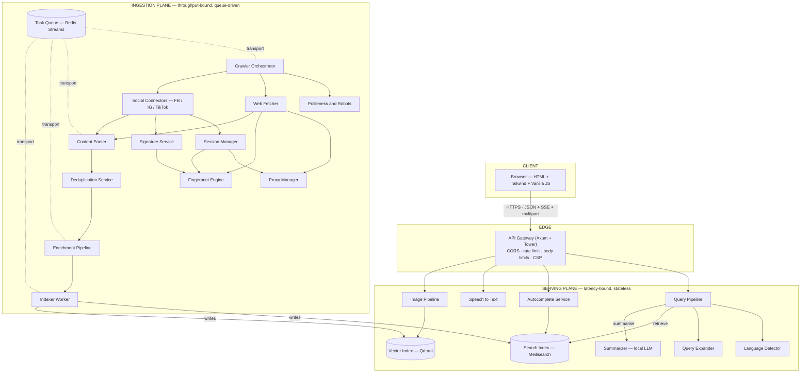

---
tags:
  - architecture
type: architecture
status: specified
updated: 2026-08-06
---

# System Architecture

> Parent: [[Xustive Search Engine – Technical Specification]] · Inventory: [[Component Map]]

---

## 1. Architectural Style

Xustive is a **two-plane system**:

- **Serving plane** — synchronous, latency-bound, stateless Rust services in front of two indexes.
- **Ingestion plane** — asynchronous, throughput-bound, queue-driven worker pools.

The only coupling between planes is the **index** ([[Search Index]], [[Vector Index]]). Ingestion can
be entirely down and search still serves; search can be down and ingestion keeps filling the index.
This is deliberate: crawling is the fragile part, and it must never be able to take search offline.

Everything runs inside one Docker network on Algerian infrastructure. No component makes an outbound
call to a third-party AI/analytics service — see [[Security and Privacy]].

---

## 2. Layer Diagram

**Legend — every box links to its specification:**

| Layer | Components |
|:---|:---|
| Client | [[UI Specification]] |
| Edge | [[API Gateway]] |
| Serving | [[Query Pipeline]] · [[Language Detector]] · [[Query Expander]] · [[Autocomplete Service]] · [[Speech to Text]] · [[Image Pipeline]] · [[Search Index]] · [[Vector Index]] · [[Summarizer]] |
| Ingestion | [[Crawler Orchestrator]] · [[Politeness and Robots]] · [[Proxy Manager]] · [[Web Fetcher]] · [[Social Connector - Facebook]] · [[Social Connector - Instagram]] · [[Social Connector - TikTok]] · [[Content Parser]] · [[Deduplication Service]] · [[Enrichment Pipeline]] · [[Indexer Worker]] · [[Task Queue]] |
| Collection | [[Session Manager]] · [[Fingerprint Engine]] · [[Signature Service]] — added by [[ADR-0009 - Direct Collection for Social Platforms]]; the only **stateful** part of the ingestion plane |
| Platform | [[Observability]] (Prometheus · Grafana · tracing) · [[Deployment Topology]] (Docker Compose) |

---

## 3. Serving Path (a single text query)

| # | Step | Component | Budget |
|:--|:--|:--|:--|
| 1 | TLS terminate, rate-limit, assign `request_id` | [[API Gateway]] | 2 ms |
| 2 | Normalise query (NFKC, tatweel strip, diacritics fold) | [[Query Pipeline]] | 1 ms |
| 3 | Detect language + script | [[Language Detector]] | 3 ms |
| 4 | Expand Darija / Arabizi variants | [[Query Expander]] | 8 ms |
| 5 | Multi-search against Meilisearch (docs + comments) | [[Search Index]] | 50 ms |
| 6 | Merge, dedupe, re-rank, build facets | [[Ranking and Relevance]] | 15 ms |
| 7 | Serialise `results` frame → flush to client | [[API Gateway]] | 5 ms |
| 8 | Stream summary tokens over SSE | [[Summarizer]] | ≤ 2500 ms |

**Key decision:** steps 1–7 return before step 8 begins. The client renders links immediately and the
AI summary streams in above them. The summary is *never* on the critical path — if [[Summarizer]] is
saturated the response simply omits it. See [[ADR-0004 - Stream Summary Separately from Results]].

## 4. Ingestion Path (a single document)

| # | Stage | Component | Stream out |
|:--|:---|:---|:---|
| 1 | Seed / sitemap / social cursor → frontier scheduling, per-host budget | [[Crawler Orchestrator]] | `q:fetch` |
| 2 | Retrieve bytes (static or headless) via a chosen egress | [[Web Fetcher]], [[Social Connector - Facebook]], [[Social Connector - Instagram]], [[Social Connector - TikTok]], [[Proxy Manager]] | `q:parse` |
| 3 | Raw HTML/JSON → canonical `Document` ([[Data Model]]) | [[Content Parser]] | — |
| 4 | Exact-hash + SimHash near-duplicate gate | [[Deduplication Service]] | `q:enrich` |
| 5 | Sentiment, entities, OCR, CLIP embeddings, quality/spam | [[Enrichment Pipeline]], [[Sentiment Engine]], [[Image Pipeline]] | `q:index` |
| 6 | Batched upserts, ack-after-durable | [[Indexer Worker]] | → [[Search Index]] + [[Vector Index]] |

Each hop is a Redis Stream consumer group, so every stage scales independently and failures land in
a per-stage dead-letter stream. See [[Task Queue]] and [[Error Handling and Resilience]].

---

## 5. Boundaries and Contracts

| Boundary | Contract | Owner |
|:---|:---|:---|
| Browser ↔ Gateway | [[API Contract]] (versioned `/api/v1`) | [[API Gateway]] |
| Gateway ↔ serving components | In-process Rust traits, `async fn` | [[Query Pipeline]] |
| Stage ↔ stage (ingestion) | JSON envelope on a Redis Stream | [[Task Queue]] |
| Any writer ↔ index | `Document` / `Comment` structs | [[Data Model]] |
| Ops ↔ everything | `/healthz`, `/readyz`, `/metrics` | [[Observability]] |

**Rule:** ingestion workers never talk to each other directly and never read the serving API. All
inter-stage communication goes through the queue so that any stage can be restarted, replayed, or
scaled without coordination.

---

## 6. Process and Deployment Units

| Binary | Contains | Scale unit | Stateless? |
|:---|:---|:---|:---|
| `xustive-api` | [[API Gateway]], [[Query Pipeline]], [[Language Detector]], [[Query Expander]], [[Autocomplete Service]] | replicas behind LB | yes |
| `xustive-ml` | [[Summarizer]], [[Speech to Text]], [[Image Pipeline]], [[Sentiment Engine]] (transformer mode) | replicas, GPU-optional | yes (models on disk) |
| `xustive-crawler` | [[Crawler Orchestrator]], [[Web Fetcher]], social connectors, [[Proxy Manager]], [[Session Manager]], [[Fingerprint Engine]], [[Signature Service]] | replicas per source class | yes (identity state in Redis, encrypted) |
| `xustive-worker` | [[Content Parser]], [[Deduplication Service]], [[Enrichment Pipeline]], [[Indexer Worker]] | replicas per queue depth | yes |
| `meilisearch` | [[Search Index]] | single + replica | **no** — volume |
| `qdrant` | [[Vector Index]] | single | **no** — volume |
| `redis` | [[Task Queue]] | single + AOF | **no** — volume |

ML models live in a read-only shared volume so `xustive-ml` replicas start without downloading
anything. Full sizing in [[Deployment Topology]].

---

## 7. Cross-Cutting Concerns

- **Request identity** — every request gets a `request_id` (ULID); every ingestion message carries a
  `trace_id`. Both propagate through `tracing` spans. See [[Observability]].
- **Configuration** — one layered config: defaults → `config/*.toml` → environment variables. No
  component reads env vars directly; they receive a typed config struct at construction.
- **Backpressure** — queue depth is the single global signal. Fetchers pause when `q:enrich` exceeds
  its high-water mark rather than letting Redis grow unbounded. See [[Error Handling and Resilience]].
- **Zero query logging** — the gateway is the only place a raw query exists in memory; it is never
  written to a log line, metric label, or trace attribute. See [[Security and Privacy]].

---

## 8. Explicitly Out of Scope (v1)

- User accounts, personalisation, saved searches.
- Real-time push/streaming index updates (near-real-time via queue is enough).
- Federated/multi-region deployment.
- Crawling content behind authentication or paywalls — see [[Legal and Compliance]].

---

## 9. Open Questions

- [ ] Do we need a separate read replica of Meilisearch before beta, or is one node enough at 10M docs?
- [ ] Should [[Sentiment Engine]] run inside `xustive-worker` or as an RPC to `xustive-ml`? (see [[Decision Log]])
- [ ] Query embeddings for semantic text search — v1 or v2?

## Related

[[Component Map]] · [[Data Model]] · [[API Contract]] · [[Deployment Topology]] ·
[[Performance Budgets]] · [[TODO]]
